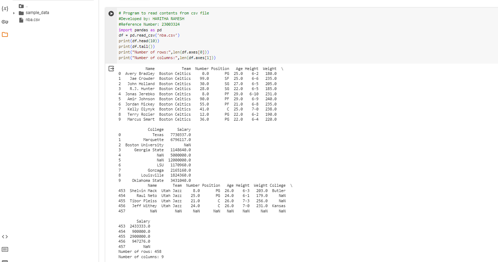
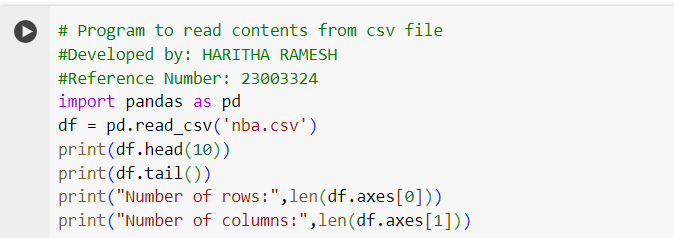
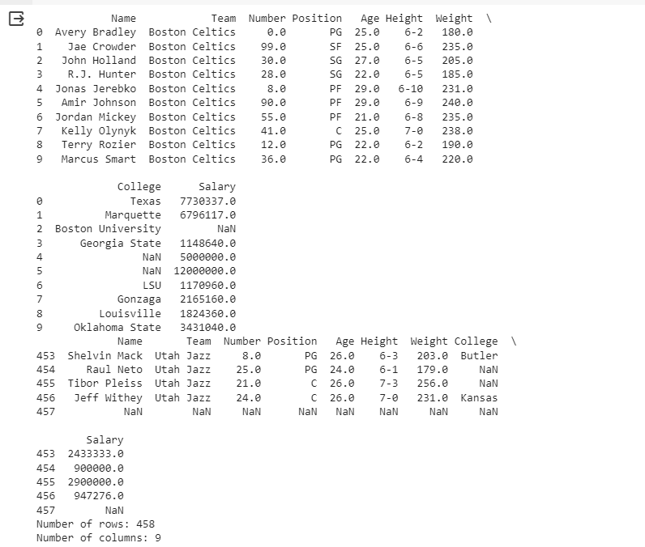

# Read-from-CSV

## AIM:
To write a python program for reading content from a CSV file.
## EQUIPMENTS REQUIRED:
1. Hardware – PCs
2.	Anaconda – Python 3.7 Installation / Google collab

## ALGORITHM:
### Step 1:
Import pandas as pd.
### Step 2:
Read the CSV file using read_csv method.
### Step 3:
Use head and tail method to get the required contents from the file.
### Step 4:
Use len() method to get the number of rows and columns.
### Step 5:
Display the result.
## PROGRAM:
```
# Program to read contents from csv file
#Developed by: HARITHA RAMESH
#Reference Number: 23003324
import pandas as pd
df = pd.read_csv('nba.csv')
print(df.head(10))
print(df.tail())
print("Number of rows:",len(df.axes[0]))
print("Number of columns:",len(df.axes[1]))
```

## OUTPUT:





## RESULT:
Thus python program for reading content from a CSV file is successful.
